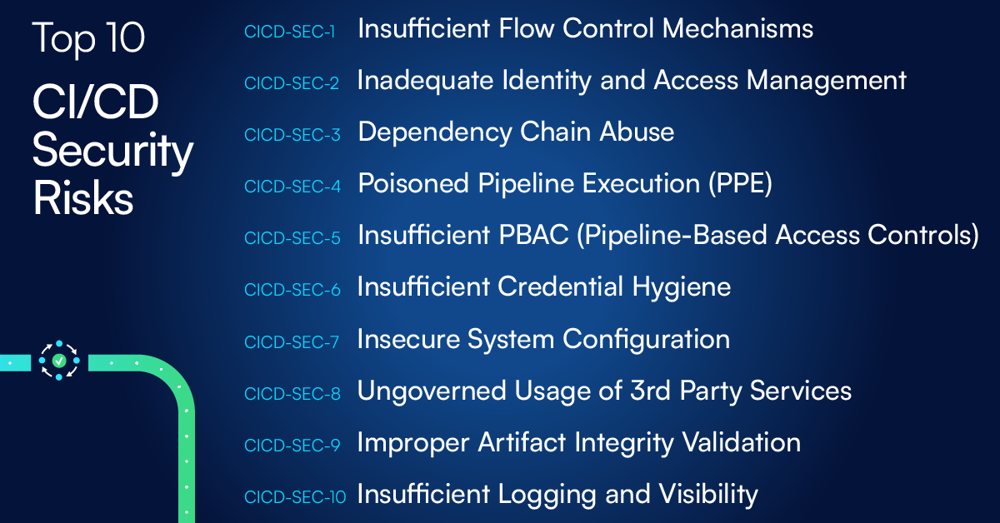

---

layout: col-sidebar
title: "OWASP Top 10 CI/CD セキュリティリスク"
tags: cicd security top10
level: 2
type: documentation
pitch: CI/CD 環境における Top 10 セキュリティリスク

---

# はじめに

CI/CD 環境、プロセス、システムは現代のソフトウェア組織の心臓部です。CI/CD はエンジニアのワークステーションからコードを配信します。DevOps 規律とマイクロサービスアーキテクチャの台頭と相まって、CI/CD システムとプロセスはエンジニアリングエコシステムを再構築しました。

* コーディング言語と、パイプラインのさらに下に採用されたテクノロジとフレームワーク (GitOps, K8s など) の両方に関連して、技術スタックがより多様化しています。
* 新しい言語とフレームワークの採用は重大な技術的障壁を伴うことなく、ますます迅速に行われています。
* 自動化や Infrastructure as Code (IaC) プラクティスの使用が進んでいます。
* サードパーティは外部プロバイダという形でも、コード上の依存関係という形でも、CI/CD エコシステムの主要な部分となっており、新サービスの統合には通常 1 ～ 2 行のコードを追加する程度で済むようになっています。

これらの特徴はより速く、より柔軟で多様なソフトウェア配信を可能にします。しかし、その一方で攻撃者にとって新たな道筋や機会が数多く存在し、攻撃対象領域が再形成されていることにもなっています。

あらゆる知識レベルの攻撃者が CI/CD に注意を移してきており、CI/CD サービスが組織の至宝に到達する効率的な経路を提供することを認識しています。この業界では CI/CD エコシステムの欠陥を悪用することに焦点を当てたインシデントや攻撃ベクトルの量、頻度、規模が大幅な増加を目の当たりにしています。

* **SolarWinds** ビルドシステムの侵害、これは 18,000 の顧客にマルウェアを拡散するために使用されました。
* **Codecov** の侵害、これは多数の企業にわたる数千のビルドパイプラインの環境変数内に格納されたシークレットの流出につながりました。
* **PHP の侵害**、バックドアを含む悪意のあるバージョンの PHP が公開される結果となりました。
* **依存関係の混乱** の欠陥、外部の依存関係を取得する欠陥を悪用して、開発者のワークステーションとビルド環境で悪意のあるコードを実行し、多数の巨大企業に影響を及ぼしました。
* **NPM パッケージ _ua-parser-js_, _coa_, _rc_** の侵害、それぞれ数百万のダウンロードがあり、数百万のビルド環境と開発者のワークステーションで悪意のあるコートが実行される結果となりました。

攻撃者はその技法を CI/CD の新しい現実に適応させていますが、防御側のほとんどはこれらの環境に関連するリスクを検出、理解、管理する正しい方法を見つけるための取り組みの初期段階にあります。最適なセキュリティとエンジニアリング速度の間の適切なバランスを求めて、セキュリティチームはセキュリティを犠牲にすることなくエンジニアリングが俊敏性を維持できる最も効果的なセキュリティコントロールを探しています。

# "Top 10 CI/CD セキュリティリスク" 構想

本文書は防御側が CI/CD エコシステムを保護するための重要分野を特定するのに役立ちます。これは CI/CD に関連する攻撃ベクトルに関する広範な調査と、注目を集める侵害とセキュリティ上の欠陥の分析から生まれました。

今日の脅威の状況、リスク対象領域、およびこれらのリスクに対処するために防衛側が直面する課題との関連性を確保するために、複数の業種および分野にわたる多数の業界専門家が本文書の作成に協力しました。

本文書のレビューと検証に参加したすべての専門家に感謝し、謝意を表します。

## 著者

* [Daniel Krivelevich](https://twitter.com/Dkrivelev) (CTO @ Cider Security)
* [Omer Gil](https://twitter.com/omer_gil) (Director of Research @ Cider Security)

## レビュー担当者

* [Iftach Ian Amit](https://twitter.com/iiamit) (Advisory CSO @ Rapid7)
* [Jonathan Claudius](https://twitter.com/claudijd) (CISO @ Jump Crypto)
* [Michael Coates](https://twitter.com/_mwc) (CEO & Co-Founder @ Altitude Networks, Former CISO @ Twitter)
* Jonathan Jaffe (CISO @ Lemonade Insurance)
* Adrian Ludwig (Chief Trust Officer @ Atlassian)
* [Travis McPeak](https://twitter.com/travismcpeak) (Head of Product Security @ Databricks)
* Ron Peled (Founder & CEO @ ProtectOps, Former CISO @ LivePerson)
* [Ty Sbano](https://twitter.com/tysbano) (CISO @ Vercel)
* [Astha Singhal](https://twitter.com/astha_singhal) (Director of Application Security @ Netflix)
* [Hiroki Suezawa](https://twitter.com/rung) (Security Engineer @ Mercari, inc.)
* Tyler Welton (Principal Security Engineer @ Built Technologies, Owner @ Untamed Theory)
* Tyler Young (Head of Security at Relativity)
* [Ory Segal](https://twitter.com/orysegal) (Senior Director, Product Management @ Palo Alto Networks)
* Noa Ginzbursky (DevOps Engineer @ Cider Security)
* [Asi Greenholts](https://twitter.com/TupleType) (Security Researcher @ Cider Security)

# Top 10 リスク
以下に示すのは Top 10 CI/CD リスクです。すべてのリスクは一貫して構造を持っています。

* **定義** - リスクの性質の簡潔な定義。
* **解説** - コンテキストと攻撃者の動機の詳細な説明。
* **影響** - リスクの現実が組織に及ぼす潜在的な影響に関する詳細。
* **推奨事項** - 問題のリスクに関連して組織の CI/CD 態勢を最適化するために推奨される一連の対策とコントロール。
* **参考情報** - 問題のリスクを悪用した実例と先例のリスト。

このリストは以下の情報源に基づく広範な調査と分析に基づいて編集されました。

* 複数の業種や業界にわたる数百の CI/CD 環境のアーキテクチャ、設計、セキュリティ態勢の分析。
* 業界の専門家との深い議論。
* CI/CD セキュリティドメイン内のインシデントとセキュリティ上の欠陥を詳述する出版物。関連する事例を掲載しています。

Top 10 CI/CD セキュリティリスクのリスト:

[CICD-SEC-1](CICD-SEC-01-Insufficient-Flow-Control-Mechanisms.md): 不十分なフロー制御メカニズム (Insufficient Flow Control Mechanisms)

[CICD-SEC-2](CICD-SEC-02-Inadequate-Identity-And-Access-Management.md): 不十分な ID およびアクセス管理 (Inadequate Identity and Access Management)

[CICD-SEC-3](CICD-SEC-03-Dependency-Chain-Abuse.md): 依存チェーンの悪用 (Dependency Chain Abuse)

[CICD-SEC-4](CICD-SEC-04-Poisoned-Pipeline-Execution.md): 有害なパイプライン実行 (Poisoned Pipeline Execution (PPE))

[CICD-SEC-5](CICD-SEC-05-Insufficient-PBAC.md): 不十分なパイプラインベースのアクセス制御 (Insufficient PBAC (Pipeline-Based Access Controls))

[CICD-SEC-6](CICD-SEC-06-Insufficient-Credential-Hygiene.md): 不十分な認証情報衛生 (Insufficient Credential Hygiene)

[CICD-SEC-7](CICD-SEC-07-Insecure-System-Configuration.md): 安全でないシステム構成 (Insecure System Configuration)

[CICD-SEC-8](CICD-SEC-08-Ungoverned-Usage-of-3rd-Party-Services.md): サードパーティサービスの無秩序な使用 (Ungoverned Usage of 3rd Party Services)

[CICD-SEC-9](CICD-SEC-09-Improper-Artifact-Integrity-Validation.md): 不適切なアーティファクト完全性バリデーション (Improper Artifact Integrity Validation)

[CICD-SEC-10](CICD-SEC-10-Insufficient-Logging-And-Visibility.md): 不十分なログ記録と可視化 (Insufficient Logging and Visibility)
